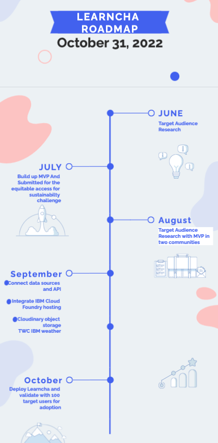

# Learncha

_Read this in other languages: [English](README.md), [한국어](./docs/README.ko.md), [português](./docs/README.pt_br.md), [中文](./docs/README.zh.md)._ 

## Contents

- [Learncha](#learncha)
  - [Contents](#contents)
  - [Short description.](#short-description)
    - [What's the problem?](#whats-the-problem)
    - [How can technology help?](#how-can-technology-help)
    - [The idea](#the-idea)
  - [Demo video](#demo-video)
  - [The architecture](#the-architecture)
  - [Long description](#long-description)
    - [LEARNCHA](#learncha-1)
    - [DID YOU KNOW?](#did-you-know)
    - [The Problem](#the-problem)
    - [SOLUTION](#solution)
    - [Conclusion](#conclusion)
  - [Project roadmap](#project-roadmap)
        - [Learncha currently does the following:](#learncha-currently-does-the-following)
      - [it currently runs on IBM Cloud Foundary.](#it-currently-runs-on-ibm-cloud-foundary)
      - [See below for our proposed schedule on next steps after Call for Code 2021 submission.](#see-below-for-our-proposed-schedule-on-next-steps-after-call-for-code-2021-submission)
  - [Live demo](#live-demo)
  - [Built with](#built-with)
    - [Online](#online)

## Short description.
Learncha is an online and offline learning resources and a more immersive learning platform for kids using gaming to teach children in remote communities on climate and at same time have access to equitable educational tools and STEM games to enhance outside classroom learning
### What's the problem?

 - Nigeria now has about 20 million out of school children according to the latest global data on out of school children by the United Nations Educational Scientific and Cultural Organization (UNESCO). According to UNESCO Institute for Statistic (UIS) and Global Education Monetary (GEM) report the education deprivation in Nigeria is driven by economic barriers, climatic and socio cultural norms and practices especially in poor marginalized communities.
 
- The education deprivation in northern Nigeria is driven by various factors, including economic barriers, climatic, socio-cultural norms and practices that 
discourage attendance in formal education, especially for girls.

### How can technology help?

Access to quality education for children is deprived by economic barrier, climatic and socio cultural norms and practices. With technology the barriers to learning for kids will be bridged and the overall learning experience will be increased for outside classroom. This will be a milestone in changing overall the access to quality of education in disadvantaged remote communities

### The idea

Learncha is an online and offline learning resources and a more immersive learning platform for kids using gaming to teach children in remote communities on climate and at same time have access to equitable educational tools and STEM games to enhance outside classroom learning

## Demo video

[Watch the video](https://www.youtube.com/watch?v=hI54VopbpZI)

## The architecture

[Video transcription/translation app](https://github.com/CaptRaven/LEARNCHA/blob/)

1. The user navigates to the site 
2. the platform is hosted on cloudinary
3. IBM TWC fetches weather information
4. PostgreSQL is used for database management.

## Long description
### LEARNCHA

### DID YOU KNOW?

According to UNICEF Even though primary education is officially free and compulsory, about 10.5 million of the country’s children aged 5-14 years are not in school ?!
The education deprivation in northern Nigeria is driven by various factors, including economic barriers, climatic, socio-cultural norms and practices that discourage attendance in formal education, especially for girls.

[Learncha website](https://learncha.vercel.app)

### The Problem

The challenge faced by poor, remote and marginalised communities in Nigeria mostly impacted by climatic and socio factors in acessing sustainanable and equitable access to Educational and learning resources.

### SOLUTION

We built a real time software LEARNCHA that provides an online and offline learning resources and a more immersive learning platform for kids using gaming to teach children in remote communities on climate and at same time have access to equitable educational tools and STEM games to enhance outside classroom learning. 

### Conclusion

OUR SOLUTION LEARNCHA that provides an online and offline learning resources and a more immersive learning platform for kids using gaming to teach children in remote communities on climate and at same time have access to equitable educational tools and STEM games to enhance outside classroom learning. 

<!-- [More detail is available here](./docs/DESCRIPTION.md) -->

## Project roadmap

##### Learncha currently does the following:
- online and offline learning resources
- immersive learning platform for kids using gaming to teach children in remote communities on climate,
  the games include:
  - 4 Pics One Word
  - Memory Boxes
  - Math And Climate
 - to enhance child learning experience
- A climate challenge can be created and get people around the world to join and solve climate problems around the world.
-Dictionary platform to check meaning of words and learn new words
-Quiz platform to help children answer trivia questions and earn sharable points
-It also has the book platform which has readable contents ranging from grade 1-6
#### it currently runs on IBM Cloud Foundary.
#### See below for our proposed schedule on next steps after Call for Code 2021 submission.

## Live demo

You can find a running system to test at [learncha.vercel.app](https://learncha.vercel.app).
OFFLINE DEMO LINK [learncha-offline](https://github.com/farex4sure/learncha_ussd) simulator sandbox-(https://simulator.africastalking.com/) USSD CODE-*384*220022#
[Android APK file] - (https://drive.google.com/drive/folders/1PEd1w896QDc1zdrMJEORP88QU2eQbE8m)

See the "long description" field in our submission (not in this repo) for the log-in credentials.

## Built with
### Online
  
- [IBM Cloud Foundary](https://www.ibm.com/sa-en/cloud/cloud-foundry) - Used for hosting
- [IBM The Weather Company](https://www.ibm.com/products/weather-company-data-packages) - Weather API used for climate challenge
- [PostgreSQL](https://www.postgresql.org/) - Database management system
- [Cloudinary](https://cloudinary.com/documentation) - Object Storage
- [FASTAPI](https://fastapi.tiangolo.com/) - Python Web API used 
- [Text-To-Speech](https://developer.mozilla.org/en-US/docs/Web/API/Web_Speech_API/Using_the_Web_Speech_API) - API used for text to speech
- [Speech-Recognition](https://developer.mozilla.org/en-US/docs/Web/API/Web_Speech_API/Using_the_Web_Speech_API) - API used for speech recognition
- [React JS](https://reactjs.org) - JavaScript Library for user interface

Offline
- [trivia API](https://the-trivia-api.com/) - API used for Trivia quiz
- [Dictionary API](https://api.dictionaryapi.dev/api/v2/entries/en/word) - Used to fetch meaning of words
- [MySQL]() - Database management system used
- [Thesaurus API](https://api.api-ninjas.com/v1/thesaurus?word=<word>) - APi used to fetch Thesaurus

